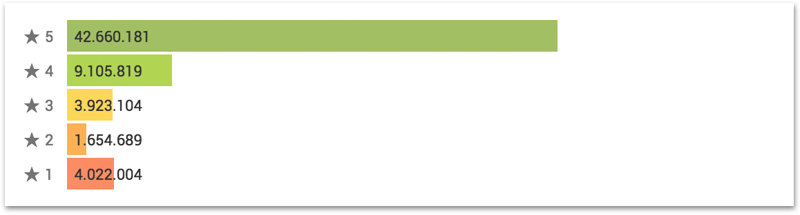

# react-rating-stats

React rating stats component


## [Demo](https://dhwk.github.io/react-rating-stats/)
```sh
cd demo
npm install
npm start
```

## Usage
```sh
npm install react-rating-stats
```
```js
import React from 'react'
import { render } from 'react-dom'
import { ThemeProvider } from 'react-jss'
import Rating, { theme } from 'react-rating-stats'

const App = () => (
  <ThemeProvider theme={theme}>
    <Rating values={[4022004, 1654689, 3923104, 9105819, 42660181]} />
  </ThemeProvider>
)

render(<App />, document.getElementById('root'))    
```

## Exports

### `Rating` (default)

Package default export, aligns components `Score` and `Histogram`
* `values` – Array of integer rating counters

```JSX
<Rating values={[4022004, 1654689, 3923104, 9105819, 42660181]} />
```


### `Score`
* `values` – Array of integer rating counters

```JSX
<Score values={[4022004, 1654689, 3923104, 9105819, 42660181]} />
```


### `Histogram`
* `values` – Array of integer rating counters

```JSX
<Histogram values={[4022004, 1654689, 3923104, 9105819, 42660181]} />
```


### `Stars`
* `value` – Integer number `[0, max]` of current rating
* `max` – Integer maximum number of stars

```JSX
  <Stars value={4} max={8} />
```


## License

MIT
